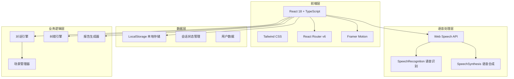

# SpeakPal - 技术架构文档

## 1. 系统架构设计



## 2. 技术栈详情

| 技术 | 版本 | 用途 |
|------|------|------|
| React | 18.x | UI框架 |
| TypeScript | 5.x | 类型系统 |
| Tailwind CSS | 3.x | 样式框架 |
| Vite | 5.x | 构建工具 |
| React Router DOM | 6.x | 路由管理 |
| Framer Motion | 11.x | 动画效果 |
| Lucide React | 最新 | 图标库 |
| Web Speech API | 原生 | 语音识别/合成 |

## 3. 路由定义

| 路由路径 | 页面组件 | 功能描述 |
|----------|----------|----------|
| / | HomePage | 首页仪表盘，展示学习概览 |
| /practice | PracticePage | 口语练习主页面 |
| /practice/:scenarioId | ScenarioPage | 特定场景练习 |
| /scenarios | ScenariosPage | 场景选择列表 |
| /report | ReportPage | 学习报告页面 |
| /profile | ProfilePage | 个人中心 |
| /teachers | TeachersPage | 老师选择页面 |

## 4. 数据模型

### 4.1 用户数据
```typescript
interface User {
  id: string;
  name: string;
  level: number;
  exp: number;
  streak: number;
  totalPracticeMinutes: number;
  selectedTeacher: TeacherType;
  unlockedTeachers: TeacherType[];
  achievements: string[];
  settings: UserSettings;
  createdAt: string;
}

type TeacherType = 'emma' | 'james' | 'lily' | 'david';

interface UserSettings {
  voiceEnabled: boolean;
  speechRate: number;
  notifications: boolean;
  dailyGoal: number;
}
```

### 4.2 对话消息
```typescript
interface Message {
  id: string;
  role: 'user' | 'ai';
  content: string;
  timestamp: number;
  correction?: Correction;
}

interface Correction {
  original: string;
  corrected: string;
  type: CorrectionType;
  explanation: string;
}

type CorrectionType = 'grammar' | 'vocabulary' | 'pronunciation' | 'tense' | 'style';
```

### 4.3 场景数据
```typescript
interface Scenario {
  id: string;
  title: string;
  titleZh: string;
  description: string;
  category: ScenarioCategory;
  difficulty: 'beginner' | 'intermediate' | 'advanced';
  icon: string;
  prompts: string[];
  introMessages: string[];
  keywords: string[];
  corrections: CorrectionRule[];
}

type ScenarioCategory = 'daily' | 'travel' | 'business' | 'social' | 'exam';

interface CorrectionRule {
  patterns: RegExp[];
  correction: string;
  type: CorrectionType;
  explanation: string;
}
```

### 4.4 学习记录
```typescript
interface LearningRecord {
  date: string;
  practiceMinutes: number;
  speakingCount: number;
  errorStats: Record<CorrectionType, number>;
  scenariosPracticed: string[];
  achievements: string[];
}
```

## 5. 组件架构

### 5.1 组件层级
```
App
├── Router
│   ├── HomePage
│   │   ├── Header
│   │   ├── StatsCards
│   │   ├── QuickStart
│   │   ├── DailyTip
│   │   └── BottomNav
│   ├── PracticePage
│   │   ├── Header
│   │   ├── TeacherAvatar
│   │   ├── ChatArea
│   │   │   ├── MessageBubble
│   │   │   └── CorrectionCard
│   │   ├── InputArea
│   │   │   ├── TextInput
│   │   │   └── VoiceInput
│   │   └── BottomNav
│   ├── ScenariosPage
│   │   ├── Header
│   │   ├── CategoryTabs
│   │   ├── ScenarioList
│   │   │   └── ScenarioCard
│   │   └── BottomNav
│   ├── ReportPage
│   │   ├── Header
│   │   ├── StatsChart
│   │   ├── ErrorAnalysis
│   │   ├── Suggestions
│   │   └── BottomNav
│   └── ProfilePage
│       ├── Header
│       ├── UserInfo
│       ├── TeacherSelector
│       ├── Achievements
│       ├── BottomNav
```

### 5.2 核心组件清单

| 组件名 | 功能 | 状态管理 |
|--------|------|----------|
| Header | 顶部导航栏 | 无状态 |
| BottomNav | 底部导航栏 | React Router NavLink |
| TeacherAvatar | 虚拟老师形象 | 动画状态 |
| ChatArea | 对话区域 | messages state |
| MessageBubble | 消息气泡 | 接收props |
| CorrectionCard | 纠错卡片 | 接收props |
| InputArea | 输入区域 | text/recording state |
| VoiceInput | 语音输入按钮 | recording状态 |
| ScenarioCard | 场景卡片 | 接收props |
| StatsCards | 统计卡片 | 接收props |
| AchievementBadge | 成就徽章 | 接收props |

## 6. 文件结构

```
/workspace/
├── public/
│   ├── favicon.svg
│   └── manifest.json          # PWA清单
├── src/
│   ├── assets/
│   │   └── avatars/          # 老师头像资源
│   ├── components/
│   │   ├── Header.tsx
│   │   ├── BottomNav.tsx
│   │   ├── TeacherAvatar.tsx
│   │   ├── ChatArea.tsx
│   │   ├── MessageBubble.tsx
│   │   ├── CorrectionCard.tsx
│   │   ├── InputArea.tsx
│   │   ├── VoiceInput.tsx
│   │   ├── ScenarioCard.tsx
│   │   ├── StatsCards.tsx
│   │   ├── AchievementBadge.tsx
│   │   └── Button.tsx
│   ├── pages/
│   │   ├── HomePage.tsx
│   │   ├── PracticePage.tsx
│   │   ├── ScenariosPage.tsx
│   │   ├── ReportPage.tsx
│   │   ├── ProfilePage.tsx
│   │   └── TeachersPage.tsx
│   ├── hooks/
│   │   ├── useSpeechRecognition.ts
│   │   ├── useSpeechSynthesis.ts
│   │   └── useLocalStorage.ts
│   ├── services/
│   │   ├── conversationEngine.ts
│   │   ├── correctionEngine.ts
│   │   └── reportGenerator.ts
│   ├── data/
│   │   ├── scenarios.ts
│   │   ├── teachers.ts
│   │   └── corrections.ts
│   ├── types/
│   │   └── index.ts
│   ├── utils/
│   │   ├── storage.ts
│   │   └── helpers.ts
│   ├── App.tsx
│   ├── main.tsx
│   └── index.css
├── index.html
├── package.json
├── tsconfig.json
├── tailwind.config.js
├── vite.config.ts
└── sw.js                     # Service Worker
```

## 7. 核心服务

### 7.1 对话引擎 (conversationEngine.ts)
```typescript
// 功能：生成AI老师的回复
// 职责：
// - 根据用户输入和场景上下文生成回复
// - 维护对话历史和状态
// - 触发纠错系统
// - 计算回复的语法和词汇复杂度
```

### 7.2 纠错引擎 (correctionEngine.ts)
```typescript
// 功能：检测并纠正用户表达错误
// 职责：
// - 语法错误检测
// - 用词错误检测
// - 时态错误检测
// - 生成纠正建议和解释
```

### 7.3 报告生成器 (reportGenerator.ts)
```typescript
// 功能：生成学习报告和个性化建议
// 职责：
// - 统计学习数据
// - 分析错误分布
// - 生成改进建议
// - 追踪学习进度
```

## 8. 语音功能实现

### 8.1 语音识别 (useSpeechRecognition.ts)
```typescript
// 使用 Web Speech API 的 SpeechRecognition
// 功能：
// - 实时语音转文字
// - 支持多种语言（英语为主）
// - 提供识别状态回调
// - 错误处理和降级方案
```

### 8.2 语音合成 (useSpeechSynthesis.ts)
```typescript
// 使用 Web Speech API 的 SpeechSynthesis
// 功能：
// - 文字转语音输出
// - 调节语速和音调
// - 选择不同语音
// - 队列管理
```

## 9. PWA配置

### 9.1 manifest.json
```json
{
  "name": "SpeakPal - 英语口语陪练",
  "short_name": "SpeakPal",
  "description": "AI虚拟老师陪你练习英语口语",
  "start_url": "/",
  "display": "standalone",
  "background_color": "#f8fafc",
  "theme_color": "#2563eb",
  "icons": [...]
}
```

### 9.2 Service Worker
- 缓存静态资源
- 离线支持
- 后台同步

## 10. 性能优化

### 10.1 路由懒加载
- 使用 React.lazy 进行代码分割
- 减少首屏加载时间

### 10.2 动画优化
- 使用 Framer Motion 的 AnimatePresence
- GPU加速动画
- 避免重排和重绘

### 10.3 状态管理
- React Context 共享全局状态
- useState 管理组件状态
- localStorage 持久化数据

## 11. 响应式设计

| 设备 | 断点 | 布局 |
|------|------|------|
| 手机 | < 640px | 单列，全屏对话 |
| 平板 | 640px - 1024px | 左侧老师，右侧对话 |
| 桌面 | > 1024px | 同平板，优化间距 |

## 12. 开发规范

### 12.1 命名规范
- 组件：PascalCase (如 TeacherAvatar.tsx)
- 工具函数：camelCase (如 storage.ts)
- 类型定义：PascalCase
- CSS类：Tailwind原子类

### 12.2 代码规范
- TypeScript 严格模式
- 函数组件 + Hooks
- 组件职责单一
- 中文注释

### 12.3 错误处理
- 语音识别失败：降级到文字输入
- 网络错误：显示友好提示
- 权限拒绝：引导用户授权
